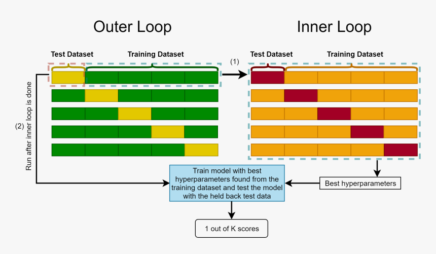

# nested_cross_val   

This repository proposes a python implementation of nested cross-validation compatible with scikit-learn API.

Our implementation stands out from already existing ones for three main reasons :
* It integrates a [dask](https://dask.org/) implementation for managing large data sets and complex pipelines and save precious computational time (more details [here](https://ml.dask.org/hyper-parameter-search.html#hyper-parameter-search)). 
* It gives access to the fitted estimators and their attributes. Therefore the user can add scores without having to refit the whole model or run different analyses with the attributes of each estimator (ex : feature importance analysis through a stability study). 
* It provides some plotting tools to visualize and analyze easily the results of the nested cross-validation (see [here](https://github.com/ncaptier/nested_cross_val/tree/main/nested_cross_val/tools)).



## Installation

```
$ pip install git+https://github.com/ncaptier/nested_cross_val#egg=nested_cross_val
```

## Experiments

We provide a jupyter notebook for an illustration of our nested cross-validation pipeline with real data :   
*[Classification of lung cancer subtype from bulk transcriptomics data](lung_cancer_classification.ipynb)

## Data

The data set which goes with the jupyter notebook [lung_cancer_classification.ipynb](lung_cancer_classification.ipynb) can be found in the .zip file [data.zip](data.zip). Please extract locally the data set before running the notebook.

## Example

```python
from sklearn.linear_model import LogisticRegression
from nested_cross_val.base import NestedCV

estimator = LogisticRegression(solver='saga' ,penalty='l1' , max_iter = 2000)

param_grid = {'C': np.logspace(-2, 2, 20)}

ncv = NestedCV(estimator = estimator , params = param_grid , cv_inner = 5  , cv_outer = 5  , 
               scoring_inner = 'roc_auc' , scoring_outer = {'roc_auc' : 'roc_auc' , 'average_precision' : 'average_precision'})

ncv.fit(X , y)
```

## Acknowledgements

This package was created as a part of my PhD in the [Computational Systems Biology of Cancer group](http://sysbio.curie.fr) of Institut Curie and the [LITO laboratory](https://www.lito-web.fr/en/).

## References
["Bias in error estimation when using cross-validation for model selection" - S. Varma & R. Simon 2006](https://www.ncbi.nlm.nih.gov/pmc/articles/PMC1397873/pdf/1471-2105-7-91.pdf)
